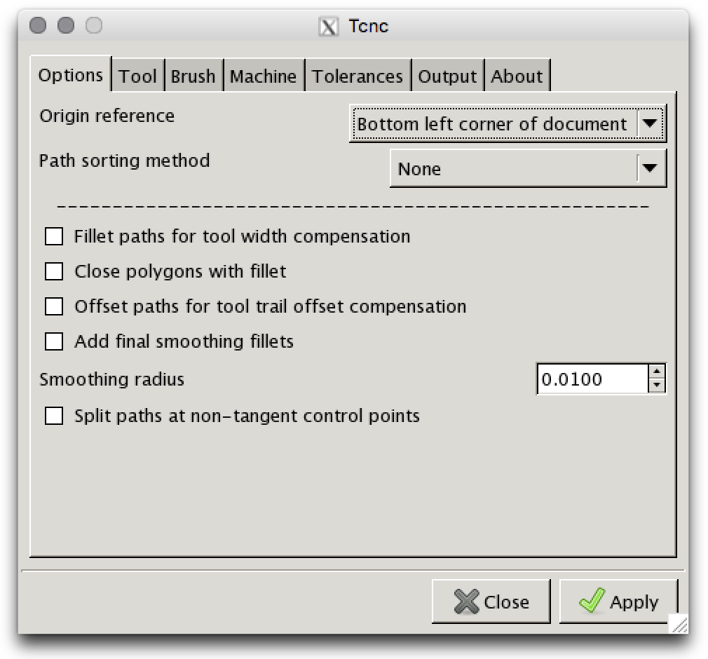
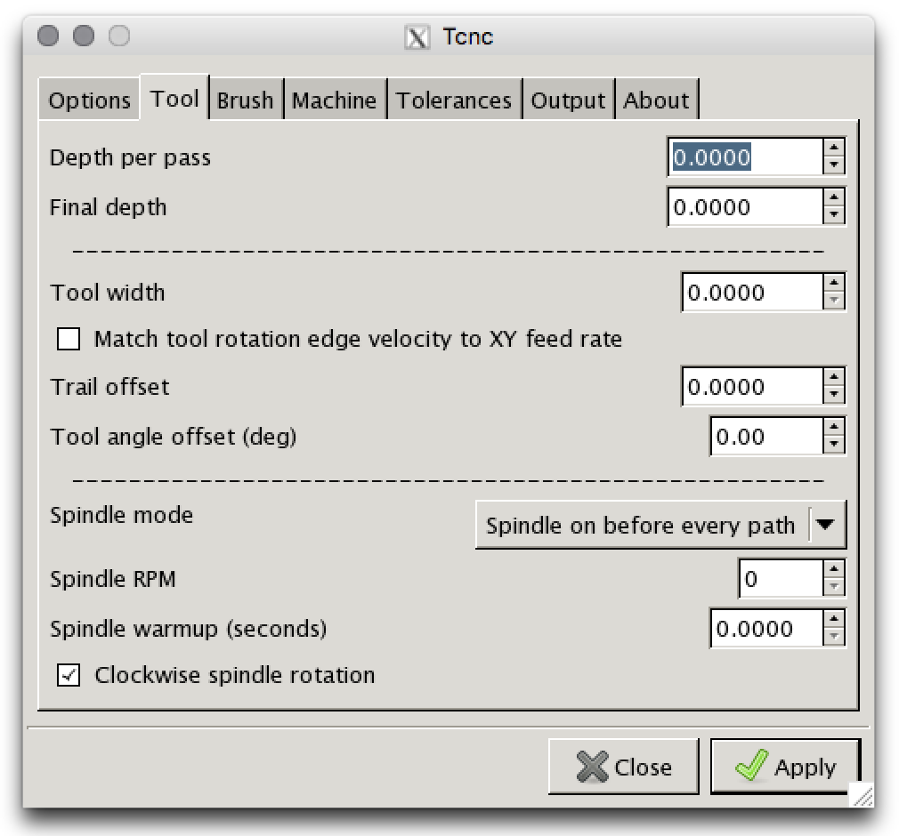
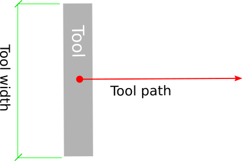
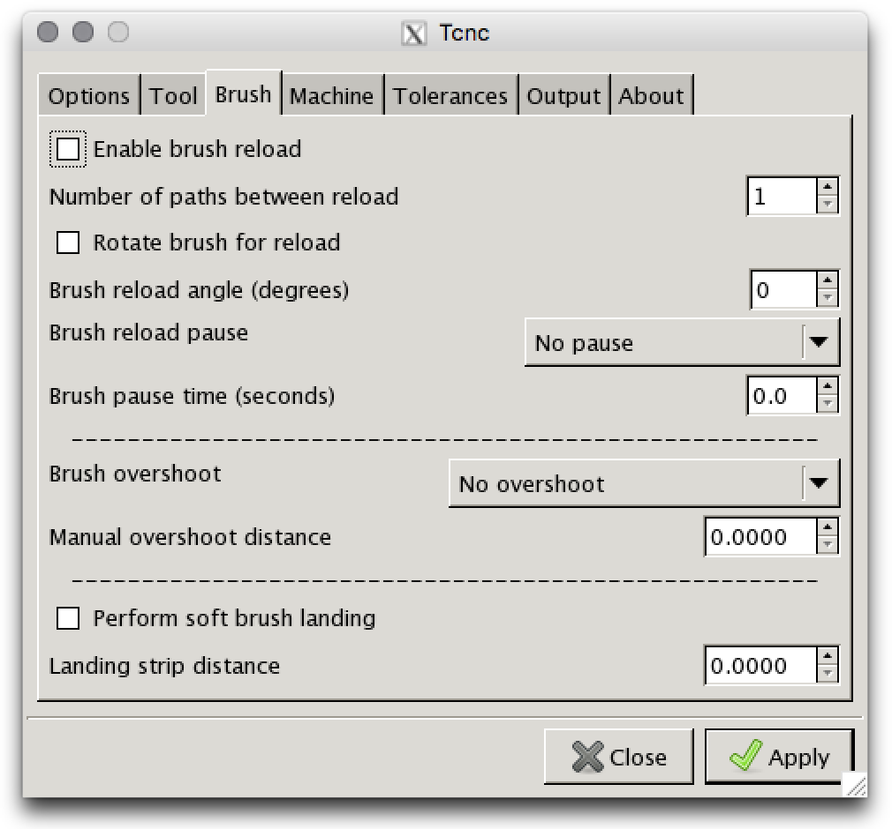
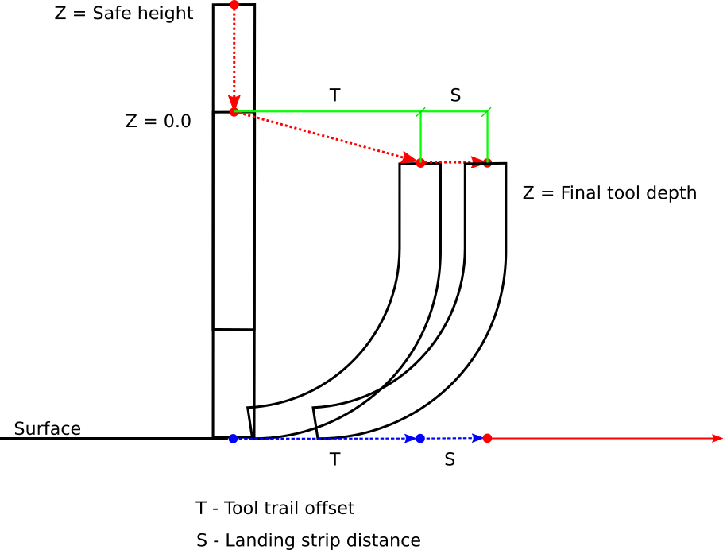
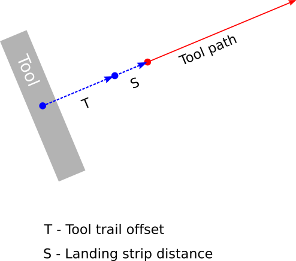
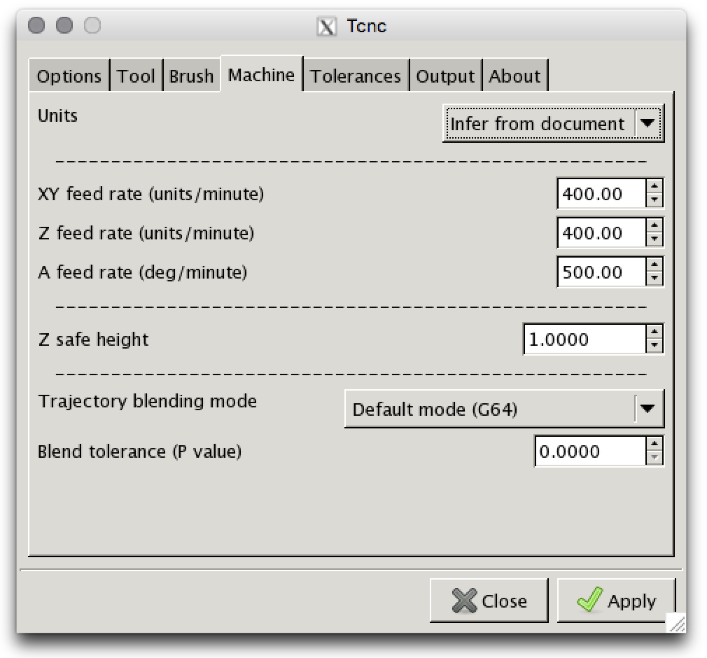
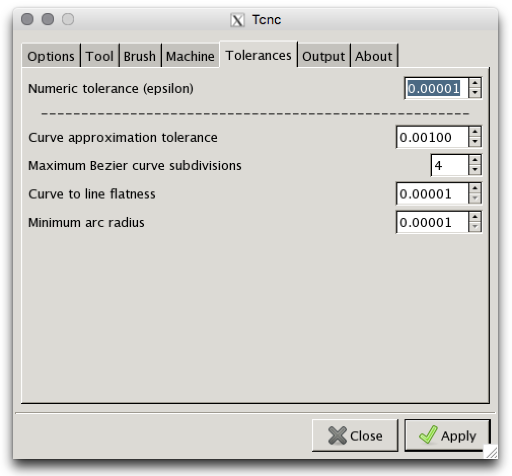
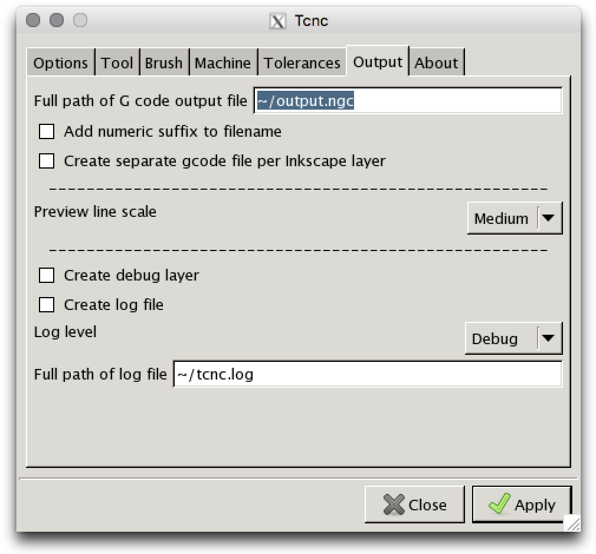

=================================
Tcnc Extension User Documentation
=================================

Tcnc is designed as an Inkscape extension plugin but
can be also invoked as a standalone program from
the command line. It will read and process SVG files.

As an Inkscape Plugin
=====================

When preparing a document to use with Tcnc set the **default units** in
**File->Document Properties...** to either **in** or **mm** and use the
same unit to specify the document size. This is optional but strongly
recommended since it
helps to avoid unexpected unit conversion issues.
Document units such as **pt** and **pc** should be avoided since
this will lead to head scratching.

Select a path in Inkscape or select a layer if you want everything on that
layer to be processed. From the **Extensions** menu select
**UTLCo** -\> **Tcnc..** and the **Tcnc** extension dialog will appear.

Tcnc only processes paths or basic shapes (circles, arcs, ellipses, boxes,
and spirals). Text or other objects must be converted to paths.

The TCnc dialog
---------------

Options
.......

Disable tangent rotation
''''''''''''''''''''''''
Normally the A axis is automatically rotated during a feed so that the tool is
always tangent to the direction of the XY movement. The A axis is assumed to
rotate about the Z axis.

If this option is selected the tangent following behaviour will be disabled.
The A axis will rotate to the initial
A axis offset (if any) and stay at that angle.

Selecting this option will also disable the path fillet and offset
options since they only make sense for a tangent tool of non-zero width
and trail.

Path sorting method
'''''''''''''''''''
- Flip paths
   Use original path order but flip (reverse) paths to shorten rapid moves.
- Bottom to top, left to right
   Sorts the paths from bottom to top and secondarily left to right.

Fillet paths for tool width compensation
''''''''''''''''''''''''''''''''''''''''
For wide brush-like tools. This will modify the path to add fillet arcs
at corners to compensate for the tool width. It mitigates rotational
artifacts caused by the wider tools.

Close polygons with fillet
''''''''''''''''''''''''''
Adds a fillet between the end of the last segment of a path and
the start of the first segment. Only applies if fillets are enabled.

Offset paths for tool trail offset compensation
'''''''''''''''''''''''''''''''''''''''''''''''
Offsets the path segments to compensate for tool trail offset.
Tools with a trail offset will
follow the orginal path much more closely.

Add final smoothing fillets
'''''''''''''''''''''''''''
This will add small fillets to non-tangential vertices of the path.
This can speed up and smooth out tool travel.

Smoothing radius
''''''''''''''''
The radius of the smoothing fillets.

Radius of smoothing fillets in document units.

Split paths at non-tangent control points
'''''''''''''''''''''''''''''''''''''''''
Split a path at non-tangent (no G1 continuity) control points (vertices).
This can avoid weird looking brush rotations at these points if tool
offset compensation is turned off or if a corner is too tight for a fillet.

Tool
....

Depth per pass
''''''''''''''
Maximum Z depth per pass if multiple passes are needed per path.
Ignored if the value is zero.

Final depth
'''''''''''
The final tool depth of the last pass. Depth per pass and final depth can
be the same if just one pass is required.

.. _tool-width:

Tool width
''''''''''
Width in document units of the tangential tool such as a brush,
scraper, or squeegee.
This will affect tool path compensation if fillets are enabled.

   Fig 2. Tool width

.. _trail-offset:

Trail offset
''''''''''''
Tool trail offset is the distance from the center of rotation to the
point of contact with the surface. Flexible tools such as brushes
and scrapers will deflect when brought to the work surface. This
creates a trailing point of contact and will cause unwanted behavior
when making relatively tight turns. Tcnc will try to recalculate the
path to compensate for this so that the center of contact follows
the original path more closely.

.. figure:: _images/tool_offset.png
   :width: 3in
   :alt: Tool trail offset

   Fig 3. Tool trail offset

Tool angle offset
'''''''''''''''''
Offset in degrees of the A axis.

..
   Wait for tool up/down
   '''''''''''''''''''''
   Time to wait for the tool to lower. This can be useful for a pneumatically
   assisted Z axis that might need a few milliseconds to actuate
   before the XY axis movement can start.

Spindle mode
''''''''''''
- No spindle
- Spindle on at start
- Spindle on before every path

Spindle RPM
'''''''''''
Spindle speed in revolutions per minute.

Spindle warmup
''''''''''''''
Time in seconds to wait for the spindle to get up to speed and warm up.

Clockwise spindle rotation
''''''''''''''''''''''''''
Direction of spindle rotation. Default is clockwise.

Brush
.....

Enable brush reload
'''''''''''''''''''

Brushes often require more paint and this enables a brush reload sequence for
manual brush reloading. Automated brush reloading is not currently supported
since it would be extremely machine dependent.

Number of paths between reload
''''''''''''''''''''''''''''''

Number of paths to output before a reload sequence is performed.

Rotate brush for reload
'''''''''''''''''''''''

Rotate the brush to the specified reload angle before each path.

Brush reload pause
''''''''''''''''''

- Pause brush until restart
   Issue a pause command which will wait until the user starts/unpauses
   the machine. Usually this is done via Axis or some other UI.

- Pause brush for time:

Brush pause time
''''''''''''''''
Amount of time in seconds that the tool feed will pause to allow
manual reloading of the brush.

Brush overshoot
'''''''''''''''

- Overshoot based on tool width
   The overshoot distance will be one half the tool width. Makes closed
   paths look a little better under some circumstances.

- Manual overshoot distance:

Manual overshoot distance
'''''''''''''''''''''''''
If `Manual overshoot distance` is selected this determines the
overshoot distance.

Perform soft brush landing
''''''''''''''''''''''''''
A flexible tool such as a brush will develop its trail distance only after
touching and pressing into the work surface. This will use the Z depth and
trail offset to create a ramp trajectory along the Z and XY axes.
See Fig 4.

Landing strip distance
''''''''''''''''''''''
The landing strip is a straight line segment appended to the soft landing
trajectory, essentially a mirror of the brush overshoot.
This will be prepended to the tool path.

   Fig 4. Soft landing Z axis trajectory

   Fig 5. Soft landing XY axis trajectory

Machine
.......

Units
'''''
G code (machine) units. These can be inches or millimeters.

- Infer from document
   Inches or mm inferred from document units. For example if the document
   is in imperial units then inches will be used, otherwise mm.
- inch
- mm

XY feed rate
''''''''''''
The feed rate of the X and Y axes. In machine units per minute.

Z feed rate
'''''''''''
The Z axis (vertical) feed rate. In machine units per minute.

A feed rate
'''''''''''
The A (rotational) axis feed rate. In degrees per minute.

Z safe height
'''''''''''''
The safe height, in machine units, of the Z axis for rapid moves.

Trajectory blending mode
''''''''''''''''''''''''
Tool path blending mode used by the machine controller.

- Default (G64)
   The default blending mode which is usually G64 - blending with a default
   tolerance.
- Blend with tolerance (G64 P`t`)
   G64 blending with a specified tolerance.
- Exact path (G61)
   Follow the exact path with no blending. Accurate but can be slow.
   The tool may come to a complete stop at path vertices.

Blend tolerance
'''''''''''''''
The blend tolerance (P) value when using the G64 P`t` blend mode.

Tolerances
..........

Numeric tolerance
'''''''''''''''''
This determines the numeric precision of floating point comparisons
and the precision (number of digits after the decimal point)
of G code output.

Curve approximation tolerance
'''''''''''''''''''''''''''''
The maximum distance, in document units, between the approximation and
the original curve.
Smaller values can result in more accurate approximations but at the expense
of slower performance.

Maximum Bezier curve subdivisions
'''''''''''''''''''''''''''''''''
Inkscape paths consist of Bezier curves and to accurately approximate them
with circular arcs they may need to be broken down into smaller curves.
Larger values can result in more accurate approximations but at the expense
of slower performance.

Curve to line flatness
''''''''''''''''''''''
Curves that are flatter than this will be approximated by a straight line.
Flatness is the maximum distance from a line between the curve end points
and the curve.
In document units.

Minimum arc radius
''''''''''''''''''
Arcs with a radius smaller than this will be replaced by a straight line.
In document units. This can avoid unexpected rotations of the tangential
tool when encountering tiny spurious curves that might be in the input path.

Output
......

Full path of G code output file
'''''''''''''''''''''''''''''''

Add numeric suffix to filename
''''''''''''''''''''''''''''''

Create separate output file per Inkscape layer
''''''''''''''''''''''''''''''''''''''''''''''

Preview line scale
''''''''''''''''''

